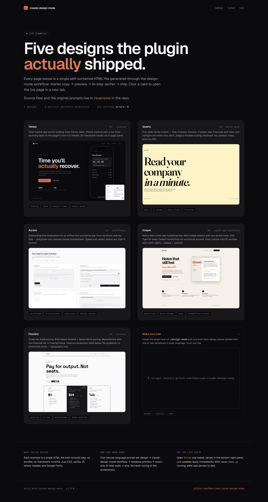
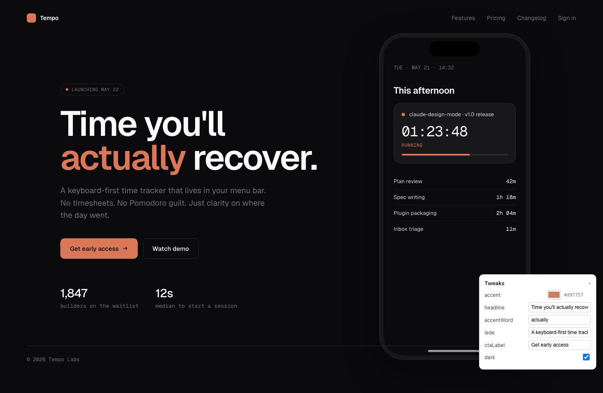
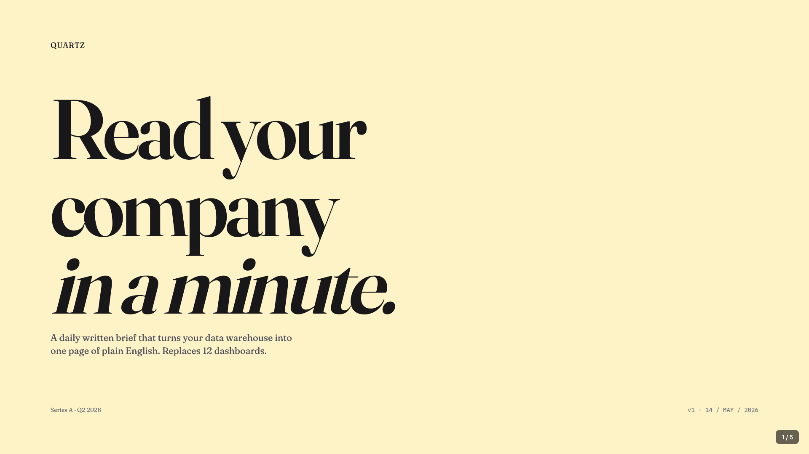
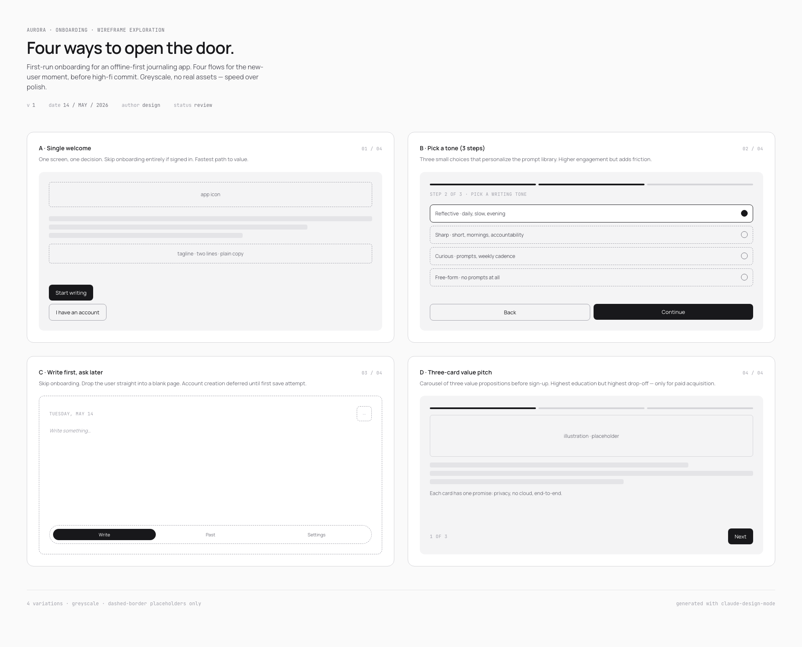
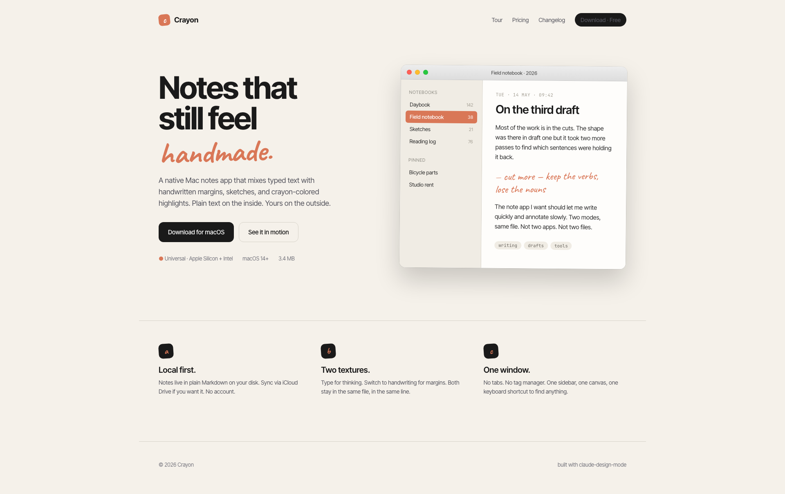
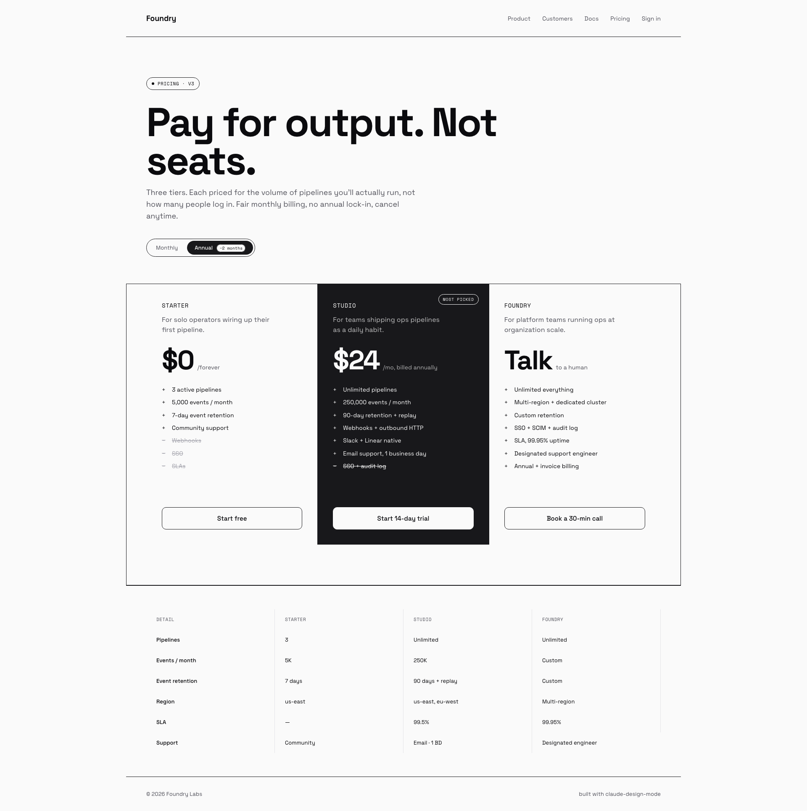

# claude-design-mode

A Claude Code plugin for HTML/JSX design artifact creation. Inspired by the Claude.ai design-mode workflow, ported to Claude Code with full Playwright preview, AI-slop verifier, starter components, in-page Tweaks panel, and 5 named sub-skills.

## Install

```
/plugin install github.com/OkminLee/claude-design-mode
```

(Or via Claude Code's plugin UI — paste the GitHub URL.)

## Showcase

Five designs. One prompt each. All live at **[okminlee.github.io/claude-design-mode/examples](https://okminlee.github.io/claude-design-mode/examples/)** — click any thumbnail to open the actual page.

[](https://okminlee.github.io/claude-design-mode/examples/)

Each design below is a single self-contained HTML file. Source + prompt for each lives in [`/examples`](examples/). Every page passed `preview.js` (`errors: 0`, `network_errors: 0`) and `design-verifier` (`✅ pass`).

---

### 01 · Tempo — landing page with iPhone mockup

**[Live →](https://okminlee.github.io/claude-design-mode/examples/tempo-launch.html)**  ·  [Source](examples/tempo-launch.html)

[](https://okminlee.github.io/claude-design-mode/examples/tempo-launch.html)

Time-tracker app launch page. Dark theme, Geist typeface, left-side headline + CTA, right-side iPhone frame containing live app UI (active-timer card + today's session list). Single accent color. The phone shows a running timer for the plugin's own v1.0 release — a self-referential demo. Six values are tweakable live via the in-page panel.

**Prompt (English):**

> Launch landing page for a time-tracker app called Tempo. Dark theme, Geist typeface. Left: eyebrow tag with launch date, bold headline with one accent-colored word, lede, primary + secondary CTA, two stat lines. Right: iPhone frame with Dynamic Island and home indicator, app UI inside showing today's date, a running timer card, and four past session rows. One accent color only — no gradients, no emoji, no three-column feature grid. Make accent color, headline text, accent word, lede, CTA label, and dark mode tweakable through the Tweaks panel.

**Prompt (한국어):**

> 시간 추적 앱 Tempo의 launch landing page. 다크 테마, Geist 타이포. 좌측: 출시일이 들어간 eyebrow tag, 한 단어만 accent 색인 bold 헤드라인, lede, primary + secondary CTA, 통계 두 줄. 우측: Dynamic Island와 home indicator가 있는 iPhone 프레임, 앱 UI 안에는 오늘 날짜, 진행 중인 타이머 카드, 지난 세션 4개. 강조 색상은 한 가지만 — gradient, emoji, 3-column feature grid 금지. accent 색상, headline 텍스트, accent 단어, lede, CTA 라벨, dark mode를 Tweaks 패널로 라이브 편집 가능하게.

---

### 02 · Quartz — five-slide pitch deck

**[Live →](https://okminlee.github.io/claude-design-mode/examples/quartz-deck.html)**  ·  [Source](examples/quartz-deck.html)

[](https://okminlee.github.io/claude-design-mode/examples/quartz-deck.html)

Series A pitch for a written-brief startup. Five slides — Title, Problem, Solution, Traction, Ask. Built on the `deck_stage.js` starter, which handles auto-scaling to viewport, keyboard navigation (arrow keys / space / Home / End), the slide counter overlay, speaker-notes `postMessage`, and `@page` injection so Cmd+P produces one PDF page per slide. Fraunces serif italic for the punchline word, IBM Plex Mono for labels.

**Prompt (English):**

> Five-slide Series A investor pitch for "Quartz" — a startup that writes a daily one-page brief from a company's data. Slide 1: title + tagline. Slide 2: problem with three statistics. Slide 3: solution — text on left, mock product brief on right. Slide 4: traction with three numeric cells (ARR, customers, retention). Slide 5: the ask, $4M, with use-of-funds breakdown. Use Fraunces serif italics on key punchline words. Each slide gets a different background — cream, dark, light, accent, dark. Include speaker notes for all five.

**Prompt (한국어):**

> "Quartz"라는 회사의 5장짜리 Series A 투자 피치덱. 매일 회사 데이터를 한 장짜리 브리프로 써주는 스타트업. Slide 1: 타이틀 + 태그라인. Slide 2: 세 가지 통계로 문제 제시. Slide 3: 솔루션 — 좌측 카피 + 우측 제품 브리프 mock. Slide 4: traction, 숫자 셀 3개 (ARR, 고객 수, retention). Slide 5: $4M 모금, 사용처 breakdown. 핵심 단어엔 Fraunces serif italic. 슬라이드마다 다른 배경 — cream, dark, light, accent, dark. 5장 모두 스피커 노트 포함.

---

### 03 · Aurora — onboarding wireframe exploration

**[Live →](https://okminlee.github.io/claude-design-mode/examples/aurora-wireframes.html)**  ·  [Source](examples/aurora-wireframes.html)

[](https://okminlee.github.io/claude-design-mode/examples/aurora-wireframes.html)

Four onboarding flows for an offline-first journaling app, laid out on a single canvas before high-fi commit. Greyscale only — no saturated color anywhere. Dashed-border placeholders for any image. Speed over polish. Each cell has a label, a one-line tradeoff, and an inline mini-mock built with flexbox.

**Prompt (English):**

> Four wireframe variations for the first-run onboarding of an offline-first journaling app, on one canvas, side by side. Variation A: single welcome screen, two buttons. Variation B: 3-step tone picker. Variation C: write first, account creation deferred. Variation D: 3-card value carousel. Greyscale only — no saturated colors. Dashed-border placeholders for images. Each cell labeled with a name and a one-line tradeoff/differentiator. Manrope sans + JetBrains Mono for labels.

**Prompt (한국어):**

> 오프라인 우선 저널링 앱의 first-run 온보딩 wireframe 4개를 한 캔버스에 좌우로 배치. Variation A: 단일 welcome 화면, 버튼 2개. Variation B: 3단계 tone picker. Variation C: write first, 계정 생성은 미룸. Variation D: 3장짜리 value carousel. 그레이스케일만 — 채도 있는 색 금지. 이미지 자리는 dashed-border placeholder. 각 셀에 이름 + 한 줄짜리 trade-off. Manrope sans + JetBrains Mono.

---

### 04 · Crayon — macOS app marketing site

**[Live →](https://okminlee.github.io/claude-design-mode/examples/crayon-notes.html)**  ·  [Source](examples/crayon-notes.html)

[](https://okminlee.github.io/claude-design-mode/examples/crayon-notes.html)

Native Mac notes app marketing landing. Warm beige palette with one accent. Inter Tight for body, Caveat handwritten serif for the punchline word and emotional accents inside the app mockup. macOS window with traffic lights, sidebar of notebooks, and a real note open in the canvas — including a handwritten margin scribble that reads `cut more — keep the verbs, lose the nouns`.

**Prompt (English):**

> Marketing landing page for a native macOS notes app called Crayon. Warm beige background, one accent color. Inter Tight for body, Caveat handwritten serif for the headline punchline word and inside the app mockup. Hero with left-side copy + right-side macOS window mockup. The window has traffic lights, a notebook sidebar (Daybook/Field notebook/Sketches/Reading log), and a real note open showing typed text plus one handwritten margin annotation. Below the hero: a 3-column band with three short value props.

**Prompt (한국어):**

> Crayon이라는 macOS 네이티브 노트 앱의 marketing landing. 따뜻한 베이지 배경, 강조색 한 가지. Inter Tight for body, Caveat 손글씨 serif는 헤드라인의 punchline 단어와 앱 mock 내부에서. Hero는 좌측 카피 + 우측 macOS 윈도우 mock. 윈도우엔 traffic lights, 노트북 sidebar (Daybook/Field notebook/Sketches/Reading log), 실제 노트 한 개가 열려 있고 타이핑된 텍스트 + 손글씨 margin annotation 한 줄 포함. Hero 아래엔 3-column band로 짧은 value prop 3개.

---

### 05 · Foundry — three-tier SaaS pricing

**[Live →](https://okminlee.github.io/claude-design-mode/examples/foundry-pricing.html)**  ·  [Source](examples/foundry-pricing.html)

[](https://okminlee.github.io/claude-design-mode/examples/foundry-pricing.html)

Pricing page for a Series B-stage SaaS. Three tiers in a hard-bordered grid. Featured tier (Studio) inverted to deep black for unmissable visual weight. Space Grotesk + Space Mono pairing — bold, technical, no apology. No checkmark icons; feature rows use `+` and `−` glyphs. Comparison table beneath. Annual billing toggle on top.

**Prompt (English):**

> Pricing page for "Foundry," a Series B SaaS that prices by output volume (events processed) rather than per-seat. Three tiers in a single hard-bordered grid: Starter ($0), Studio ($24/mo, featured/inverted background), Foundry (talk to sales). Each tier shows tier name, pitch line, big price, feature list using + / − glyphs (no checkmarks), full-width CTA button. Below the grid: 4-column comparison table (Detail, Starter, Studio, Foundry). Above the grid: monthly/annual toggle with "−2 months" save badge. Space Grotesk + Space Mono. No gradients.

**Prompt (한국어):**

> "Foundry"라는 Series B SaaS의 가격 페이지. seat 단위가 아니라 처리하는 이벤트 양으로 과금. 3-tier가 hard-bordered grid 안에 — Starter ($0), Studio ($24/월, featured는 검정 inverted), Foundry (talk to sales). 각 tier에 tier 이름, pitch line, 큰 가격, + / − 기호로 표시한 feature 목록 (체크마크 금지), full-width CTA 버튼. grid 아래엔 4-column 비교 테이블 (Detail, Starter, Studio, Foundry). grid 위엔 monthly/annual 토글, "−2 months" 절감 뱃지. Space Grotesk + Space Mono. gradient 금지.

## Quick start

In any working directory:

```
/design-mode 가운데 정렬 hero 한 개, light mode, gradient 없이
```

Claude will:

1. Ask any clarifying questions.
2. Write an HTML file in the cwd.
3. Track it in `.design-manifest.json` (asset name + version).
4. Run a Playwright preview, capturing console errors and a full-page screenshot.
5. Dispatch the `design-verifier` subagent in the background for an AI-slop audit.
6. Report file paths.

## Features

- **Manifest-tracked artifacts** — every design grouped under an asset name with versioned entries (`<Asset> v2.html`, etc.).
- **Live preview** — `preview.js` loads HTML in headless Chromium, captures console/page/network errors and a screenshot.
- **AI-slop verifier** — a read-only subagent reviews the screenshot against a 7-category checklist (gradients, accent-border cards, SVG illustrations, overused fonts, emoji, three-column feature grids, AI-headline phrases).
- **6 starter components** — `deck_stage` (slide shell), `ios_frame`, `android_frame`, `macos_window`, `browser_window`, `design_canvas`.
- **In-page Tweaks panel** — drop an `EDITMODE-BEGIN/END` JSON block + `tweaks-panel.js` mount and the user can tweak values live in the browser; a small daemon (`tweak-host.js`) auto-persists changes to disk.
- **5 sub-skills** — Make a deck, Wireframe, Make tweakable (retrofit), Save as PDF, Handoff to Claude Code.

## Sub-skills (named workflows inside `/design-mode`)

| Sub-skill | Trigger | What it does |
|---|---|---|
| Make a deck | "deck", "slides", "presentation" | Slide-deck shell with keyboard nav, scaling, speaker notes, print-to-PDF |
| Wireframe | "wireframe", "low-fi", "explore options" | Greyscale variation grid, 4–8 mocks side-by-side |
| Make tweakable | "make this tweakable" | Retrofits an existing HTML with EDITMODE block + Tweaks panel mount |
| Save as PDF | "save as PDF", "export" | `to-pdf.js` Playwright-based PDF export (A4/letter/custom) |
| Handoff to Claude Code | "handoff", "ready for implementation" | Generates `<asset>.handoff.md` with components/tokens/interactions/build sequence |

## Daemon (Tweaks persistence)

Tweaks panel changes auto-persist to disk only when `tweak-host.js` is running. Start it once per session:

```
node <plugin>/skills/design-mode/scripts/tweak-host.js
```

(Default port 5174, configurable via `--port`.) Without the daemon, tweaks apply live in browser but don't save to disk.

## Dependencies

System tools required:

- `node` (v18+) — runs the helper scripts
- `npm` / `npx` — bootstraps the in-plugin Playwright install on first preview
- `jq`, `curl` — used in some workflow shell snippets (commonly preinstalled on macOS/Linux)

On first preview/PDF call, the plugin installs Playwright + Chromium into its own `node_modules/` folder (~150 MB, 1–3 min one-time download).

## Repository structure

```
claude-design-mode/
├── .claude-plugin/plugin.json     # manifest
├── skills/design-mode/
│   ├── SKILL.md                   # the skill itself
│   ├── scripts/                   # 5 Node helpers
│   └── starters/                  # 7 starter components + 3 host templates
├── agents/design-verifier.md      # AI-slop vision audit subagent
├── README.md
└── LICENSE
```

## License

MIT — see [LICENSE](LICENSE).

## Contributing

Issues and PRs welcome at [github.com/OkminLee/claude-design-mode](https://github.com/OkminLee/claude-design-mode).
